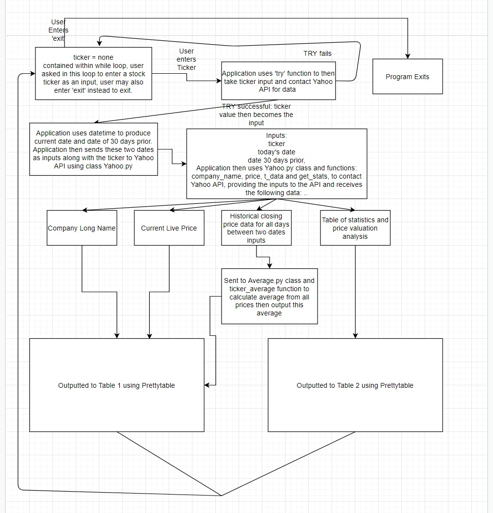

**Timothy Joel Adams – T2- Terminal Assessment – Read Me**

1.  **Installation:**

    It is recommended that you undertake the following steps for installation in
    terminal:

    git clone https://github.com/inbox237/timothyjoeladams_T2A3.git

    cd timothyjoeladams_T2A3

    python3 -m venv venv

    source venv/bin/activate

    pip install -r requirements.txt

    sudo apt update

    To run:

    python main.py

2.  **Dependencies:**

    colorama==0.4.3 – This will be used to colour text or make text bold.

    datetime – This will be used with the Average and Yahoo classes in order to
    calculate date inputs for the get_data request for the Yahoo Finance API.
    Datetime is used specifically to calculate the current date, as well as a
    date 30 days prior, these two dates are then given to the Yahoo Finance API
    to receive historical data back between those two dates.

     flake8==3.8.3 – This will be used to check the code for pep8 styling
    mistakes.

    numpy==1.19.2 – This will be used in conjunction with unittest to check that
    the instance type is a float for outputs Average and Live Price, as these
    outputs change day to day.

    pandas==1.1.2 – This will be used in conjunction with unittest to check that
    the instance type for stock valuation stats and stock historical 30 day data
    is a pandas data frame.

    prettytable==0.7.2 – This will be used to display all outputs to the user in
    neat tables.

    requests==2.24.0 – Requests and requests.html will be used to complete the
    api requests from the yahoo modules, as well as http error excepting.

    requests-html==0.10.0 – as above

    yahoo-fin==0.8.6 – The three Yahoo Finance modules are used to access the
    Yahoo Finance API so the application can receive stock information in a
    two-way communication, upon the user entering a stock ticker, and then
    receiving information back for the app to display and calculate using.

    yahoo-finance==1.4.0 – As above

    yfinance==0.1.54 – As above

3.  **Help:**

    Upon opening the application, the user will be told what to enter at each
    input stage. If at any time the user would like to quit the app, they may
    type ‘exit’ and then press enter at any of the input stages.

4.  **Statement of Purpose and Scope:**

    The purpose and scope of my application is to provide a user-friendly
    interface by which users may enter a stock ticker and receive
    stock price data including Company Long Name, Current Live Price, an average
    of the last 30 days of prices up until the current date. The user is
    prompted only to input the ticker they wish to get information on, the
    application does the rest.

5.  **Input Handling & Solution**

    The user will be asked to enter one input only, a valid ticker. This is contained within a while loop that attempts to communicate
    with the Yahoo Finance API to receive the data and complete the outputs.
    Upon entering this input incorrectly, the user is prompted to try again, or
    the user may instead enter exit as the input and the program will exit the
    while loop, display a message, then exit. Assuming the user inputs a correct
    ticker, the application will then automatically using datetime, calculate
    two dates, the current date and the date of 30 days prior. The application
    will then send the ticker name and those two dates to the Yahoo Finance API
    via the Yahoo.py class and the four functions: company_name, price, t_data,
    get_stats and receive data from Yahoo Finance for the Company Long Name,
    Current Live Price, Historical prices for the last 30 days and a table of
    valuation analysis information. The Historical prices are then sent to the
    Average.py class and contained ticker_average function in order to calculate
    an average price for the last 30 days. Prettytable and the Color.py class
    are then used to display to the user two tables. The first table contains
    the ticker capitalised, followed by the Company Long Name, the current live
    price and then the average price for the last 30 days. A second table is
    output below the first, this contains the table of analysis valuation data.
    The loop then begins again and the user is asked for a stock ticker again,
    or they may choose to exit instead.

    

6.  **Testing Application, processes:**

    Each input stage of the application was tested by putting various inputs in
    which should have produced an error as they were the incorrect input type.
    For example, where the user was asked to put in a ticker, the test tried
    entering symbols or blank spaces in instead of a number. The test procedure
    showed that the application handled these tests correctly and asked the user
    to re-enter the input after giving them a red warning message. Similarly,
    when the test data entered was ‘exit’ the program correctly exited. 4 tests
    were also implemented using unittest to test the outputs the application was
    supposed to get back from the Yahoo Finance API for a test ticker “AAPL”.
    These tested that the company_name for ticker AAPL produced “Apple Inc.”.
    The second test tested whether the live stock price received was a
    numpy.float64 type (as this data can change every day or so). The third test
    tested whether the 30 days of historical data received was a pandas
    dataframe, again because the data would be changing frequently. The fourth
    test tested whether get_stats was also a pandas dataframe. The fifth and
    final test tested whether the output from the Average.py class and function
    was also a numpy.float64 type. All tests passed successfully. Flake8 was
    used also to test each class file and the main file for pep8 styling issues.
    Upon rectifying these issues and then testing the main code was still
    functioning, git was committed, then pushed to GitHub. After pushing the
    github, a new folder on AWS was created and a fresh installation of the
    application was undertaken following steps in part 1. After following these
    steps the application ran successfully again and all the same tests were
    successful. Complete.
